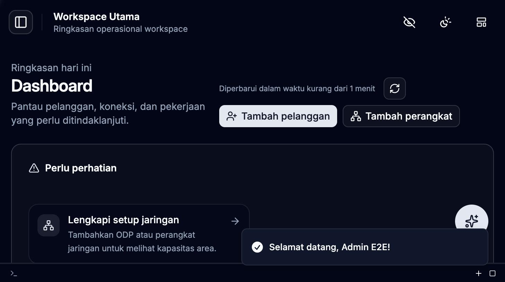
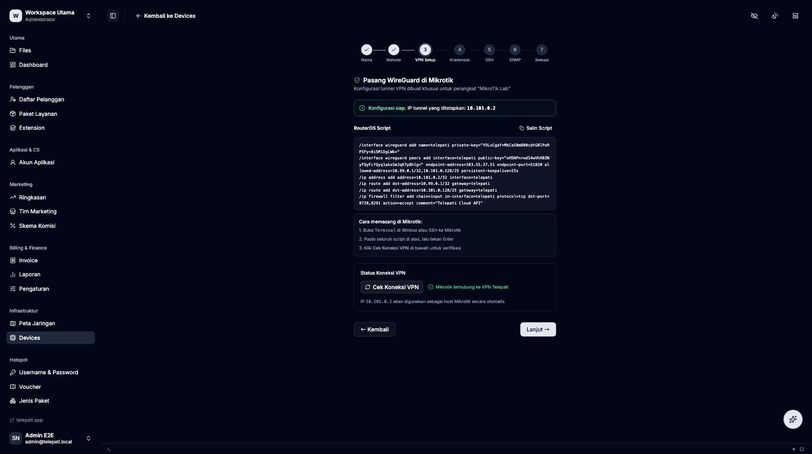
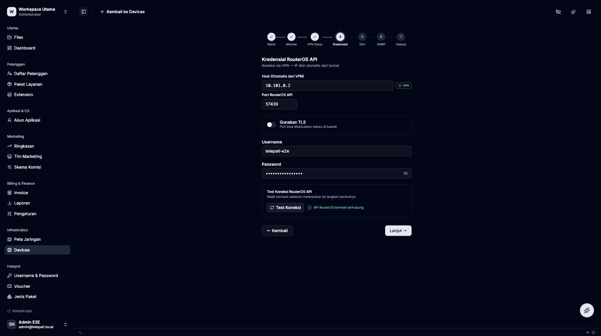
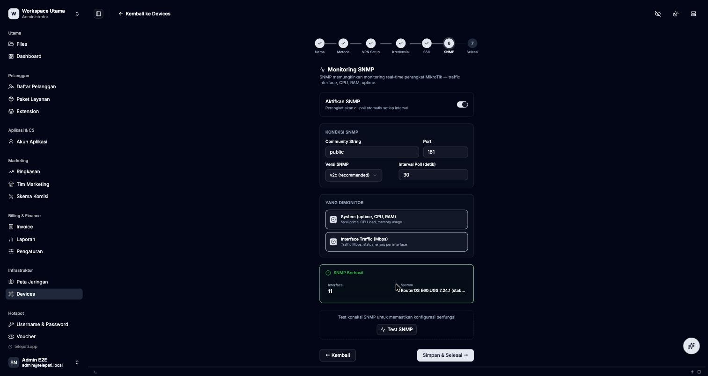
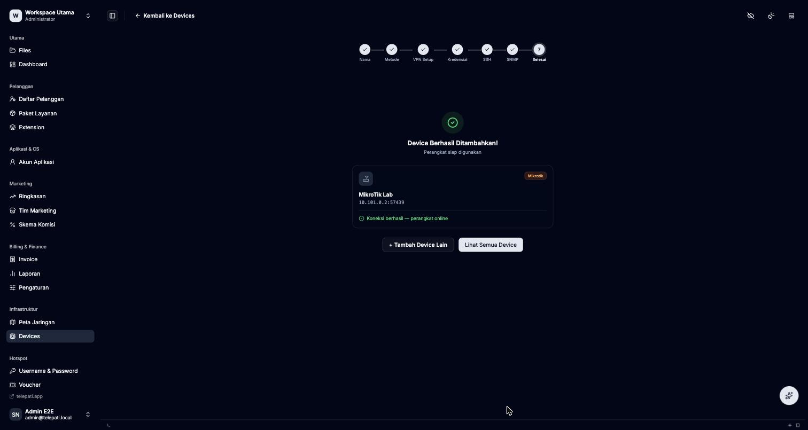
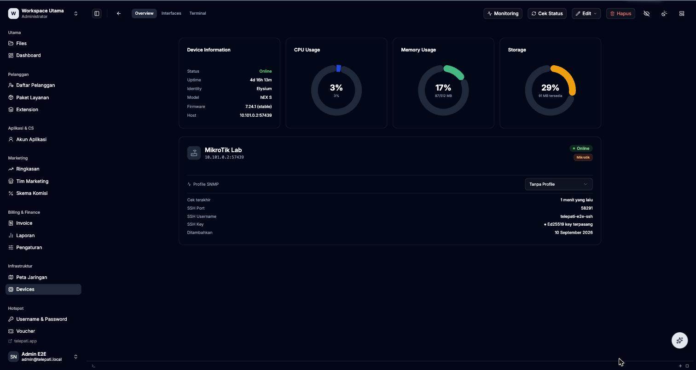

# E2E Verification: Fresh Install v0.1.0-alpha.24 + Onboarding MikroTik Real

**Tanggal**: 10 September 2026
**Target**: VM produksi IDCloudHost (`103.55.37.51`), MikroTik lab "Elysium" (hEX S, RouterOS 7.24.1)
**Hasil**: ✅ Lulus — semua fungsi inti terverifikasi live, tanpa bug yang menghentikan proses.

## Konteks

Setelah rilis `v0.1.0-alpha.24` (perbaikan origin-check WebSocket pada stream service — lihat [CHANGELOG](../../CHANGELOG.md#v010-alpha24--2026-09-10)), dilakukan verifikasi end-to-end dari nol: reinstall VM produksi, install Telepati fresh (bukan upgrade), dan sambungkan MikroTik fisik ke instance yang baru — untuk memastikan jalur *fresh install* dan fitur *router auto-provisioning* (WireGuard + RouterOS API + SNMP) benar-benar berfungsi pada instalasi baru, bukan cuma di jalur upgrade yang sudah berulang kali diuji sebelumnya.

## Lingkup pengujian

1. Reinstall OS VM (dilakukan operator via panel IDCloudHost).
2. Fresh install Telepati `v0.1.0-alpha.24` dari nol (`install.sh` → `telepati install` → `telepati setup`).
3. Onboarding MikroTik lab "Elysium" (`10.10.3.1`) sebagai device via WireGuard VPN (bukan IP publik langsung).
4. Verifikasi tiap lapisan konektivitas: VPN tunnel, RouterOS API, SSH, SNMP monitoring.
5. Verifikasi tidak ada config MikroTik lain (`reku-gcp`, `wg-remote`) yang tersentuh.

## Langkah & Hasil

### 1. Fresh install

```bash
curl -fsSL https://raw.githubusercontent.com/teliti-dev/telepati-release/main/install.sh | sudo bash
sudo telepati install
sudo telepati setup
```

- Semua 11 service (`telepati`, `telepati-wg`, `telepati-stream`, `telepati-dns`, `telepati-isolir-web`, `telepati-snmp`, `telepati-acs`, `telepati-worker`, `telepati-agent`, `telepati-radius`, `telepati-hotspot-portal`) aktif tanpa error.
- Health check lokal `200`.
- Login admin berhasil (workspace + admin dibuat lewat wizard).



### 2. Onboarding MikroTik via WireGuard VPN

Ditemukan config WireGuard basi bernama `telepati` di router (peninggalan sesi sebelum VM di-reinstall, key server sudah tidak valid). Dibersihkan secara presisi — hanya interface/peer/route/firewall-rule berlabel `telepati` yang dihapus, interface `reku-gcp` dan `wg-remote` milik keperluan lain tidak disentuh sama sekali.

Script RouterOS baru dari wizard "Tambah Perangkat" dijalankan di router:

```
/interface wireguard add name=telepati private-key="..."
/interface wireguard peers add interface=telepati public-key="..." endpoint-address=103.55.37.51 endpoint-port=51820 allowed-address=10.99.0.1/32,10.101.0.128/25 persistent-keepalive=25s
/ip address add address=10.101.0.2/32 interface=telepati
/ip route add dst-address=10.99.0.1/32 gateway=telepati
/ip route add dst-address=10.101.0.128/25 gateway=telepati
/ip firewall filter add chain=input in-interface=telepati protocol=tcp dst-port=8728,8291 action=accept comment="Telepati Cloud API"
```

Hasil: tunnel connect langsung, IP `10.101.0.2` diberikan otomatis oleh Telepati (skema per-workspace subnet `10.101.<slot>.0/24`).



### 3. RouterOS API

Port API di router lab ini sudah dikustomisasi ke `57439` (bukan default `8728`) dari konfigurasi sebelumnya. User API baru (`telepati-e2e`, grup bawaan `api-rw`, scope minimal — tidak ada akses SSH/Winbox/Web) dibuat khusus untuk koneksi ini, tanpa mengubah user API lama yang sudah ada.



### 4. SSH (opsional, di wizard)

Port SSH router juga custom (`58291`). Dibuat user terpisah `telepati-e2e-ssh` (grup `ssh-admin`) dengan autentikasi **SSH key** (Ed25519 di-generate oleh Telepati, public key di-import ke router) — bukan password, sesuai rekomendasi wizard. Test koneksi di step wizard: **berhasil**.

### 5. SNMP Monitoring

Community `public` di router lab hanya mengizinkan source-address dari range lama (`10.100.0.0/16`, `10.10.20.0/24`). Ditambahkan (bukan mengganti) range `10.99.0.0/24` — subnet tunnel server instance ini — supaya polling SNMP dari server bisa lewat. Data live berhasil ditarik: interface count, system info (model, firmware).



### 6. Device tersimpan dan online



Halaman detail device menampilkan data live yang **cocok persis** dengan hasil query manual via SSH langsung ke router (CPU, RAM, uptime, identity "Elysium", model hEX S, firmware 7.24.1) — mengonfirmasi data yang ditampilkan dashboard adalah data real perangkat, bukan data statis/cache.



## Known limitation (bukan bug baru, tidak menghentikan verifikasi)

Fitur **SSH Terminal in-browser** (halaman detail device → tab Terminal) tidak bisa connect pada mode install **"Manual (tanpa Caddy/HTTPS)"** yang dipakai pengujian ini. Root cause: `telepati-stream` (servis terpisah, port `9000`) tidak di-proxy oleh apa pun ke port `8080` tempat dashboard di-serve — fitur ini didesain same-origin dan mengandalkan reverse proxy (Caddy atau Cloudflare Tunnel) di depan, sesuai komentar eksplisit di `web/src/lib/stream-socket.ts`. Ini adalah karakteristik arsitektur mode akses "Manual", bukan regresi dari perubahan alpha.24, dan tidak menghalangi fungsi inti onboarding MikroTik (VPN, API, SSH exec, SNMP — semuanya tidak lewat servis stream ini).

**Rekomendasi**: dokumentasikan keterbatasan ini di panduan operator, atau pertimbangkan menambahkan proxy internal `/stream` → `:9000` di binary utama untuk mode akses Manual di rilis mendatang.

## Yang tidak diubah / dibersihkan

- Interface WireGuard `reku-gcp` dan `wg-remote` di router — tidak tersentuh.
- User RouterOS lama (`telepati54`, `telepati99`, `telepati-ssh`, dll dari sesi sebelumnya) — dibiarkan apa adanya, tidak dihapus.
- User baru yang dibuat (`telepati-e2e`, `telepati-e2e-ssh`) dan koneksi WireGuard `telepati` — **dipertahankan** sebagai koneksi aktif MikroTik lab ke instance Telepati ini (bukan test yang di-rollback), karena ini memang tujuan tugas: menyambungkan router ke Telepati secara permanen.

## Kesimpulan

Jalur fresh-install `v0.1.0-alpha.24` dan fitur onboarding router (WireGuard + RouterOS API + SNMP) terverifikasi bekerja end-to-end pada perangkat nyata, dengan disiplin *add-only* terhadap konfigurasi router yang sudah ada (tidak ada config pihak lain yang terhapus atau berubah).
